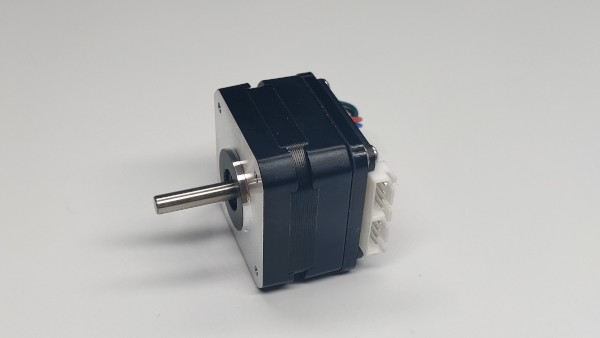
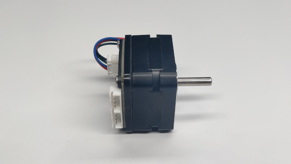
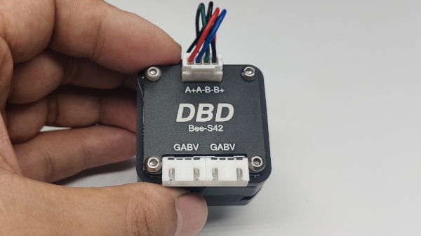
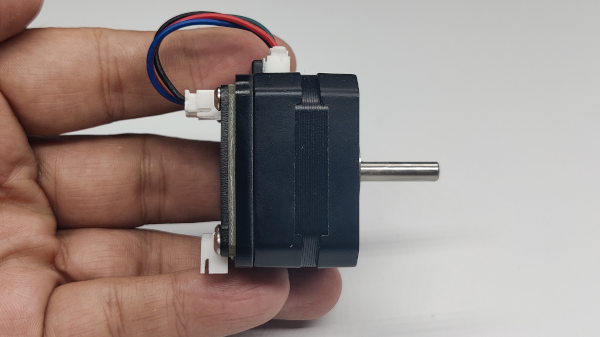
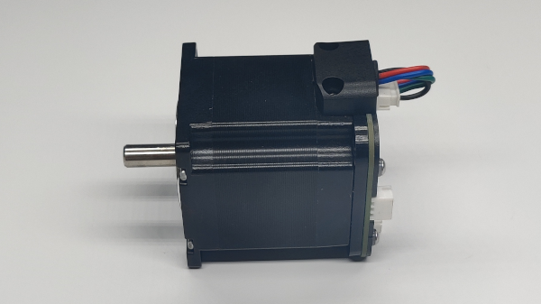
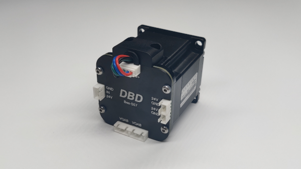
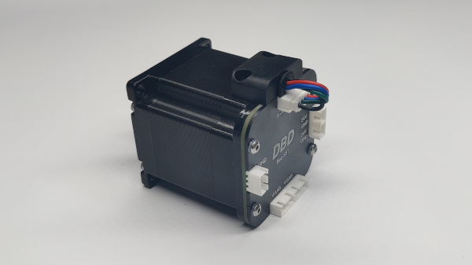
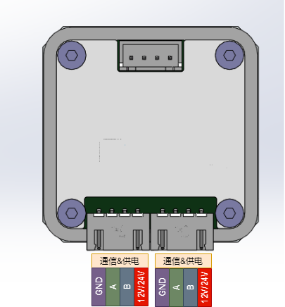

# DBD-BeeS

## About DBD
DBD is a startup manufacturer of innovative matrix motion technologies, and as a manufacturer and developer of motor drives, controllers, and systems, DBD is designing its technology with emphasis on performance, efficiency, reliability, safety and simplicity.
## About BeeS
BeeS是DBD团队开发的总线式一体闭环步进伺服电机,目前主要分为BeeS28、BeeS42、BeeS57三个尺寸型号. 采用双电源接口,双RS485隔离通信接口以及正负限位接口.此外还集成了编码器,支持位置模式、速度模式、回零模式(有感/无感)、插补模式等多种运行模式. 
## Contact Us

## 产品细节(图片)

### BeeS4223-V1 

### BeeS4223-V2

### BeeS57

### BeeS28

## 产品介绍(视频)

## 产品介绍(文字)
### 性能参数
---

|  |  |
| --- | --- |
| 重量 | 40g |
| 电机 | 4线2相步进电机 |
| 细分 | 256 |
| 编码器分辨率 | 12bit |
| 工作电压 | DC12V/24V |
| 最大持续输出电流 | 1.0A |
| PWM频率 | 20KHz |
| 输入IO | 无 |
| RS485总线 | 最高10Mbps,默认500Kbps |
| 运行温度 | -10 to +60摄氏度 |

---

### 产品细节

---

---

### 机械尺寸

---

)型号:XH2.54-4P

  

---

### 运行模式

---

|  |  |
| --- | --- |
| 位置模式 | 位置模式,全称平滑位置模式.通常称为点位运动.根据设定的目标位置,目标速度以及加速时间 自行规划位置时间曲线并开始运动.  位置模式常用API及参数：    速度－时间曲线：    API使用流程示意图： |
| 速度模式 | 速度模式,全称平滑速度模式,根据设定读目标速度和加速时间自行规划速度时间曲线并开始运动. 该模式的控制对象是电机的运行速度,不关心电机的位置. |
| 回零模式 | 进入回零模式后,根据设定的回零方向和目标速度开始运动,直到传感器触发,达到设置回零电平参数后停止运行, 并且自动将运行模式恢复为进入回零模式前的运行模式. |
| 回零模式 | 进入回零模式后,根据设定的回零方向和目标速度开始运动,直到传感器触发,达到设置回零电平参数后停止运行, 并且自动将运行模式恢复为进入回零模式前的运行模式. |
| 插补模式 | 插补模式全称同步位置插补模式,用于实现最多32轴电机的同步插补运动.该模式通常用于3D打印机,写字机,画图机,雕刻机, 点胶机等需要多轴联动,并且执行连续轨迹的设备. |

---

### 开发者

---

#### 快速上手

##### 000-上位机调试软件TunerBeeS for Windows

---

#### 通信协议

 [点击下载](downloads/BeeS.xls)

---

#### Python SDK

  

#### SDK接口

##### Python SDK接口说明

SDK接口分为4类,参数设置set类,参数获取get类,等待信号wait类,功能操作类,下面将做详细介绍.

|  |  |
| --- | --- |
| setPowerOn(id,subid) | 设置对应id号的状态为使能,使能后电机开始受驱动器控制.使能后状态指示灯由快速闪烁变为慢速闪烁. |
| setPowerOff(id,subid) | 设置对应id号的状态为失能,失能后电机不再受驱动器控制.失能后状态指示灯由慢速闪烁变为快速闪烁. |
| setTargetVelocity(id,subid, value) | 设置目标速度.数值范围通常位1-300,单位pulse/ms近似等于RPM. |
| setHomingMode(id) | 设置运行模式为回零模式,详细内容参考[运行模式](#operationmode) |
| setHomingDirection(id, value) | 设置回零方向.取值为1或者-1. |
| setHomingLevel(id, value) | 设置回零电平.取值为1或者0. |
| getInputIO(id) | 获取输入IO的状态.返回值为0或者1. |
| getTargetVelocity(id) | 获取目标速度. |
| getHomingDirection(id) | 获取回零方向. |
| getHomingLevel(id) | 获取回零电平. |
| waitHomingDone(id) | 等待回零完成. |
| waitTargetPositionReached(id) | 等待目标位置到达. |
| getDeviceID(id) | 获取设备ID. |
| scanDevices() | 扫描在线设备. |
| saveParameters(id) | 保存参数. |
| changeID(id, value) | 修改ID.ID范围0-31. |

##### 如何使用Python SDK

###### 准备工作

1.安装pyusb.用户可以通过pycharm的库管理下载添加, 或者通过命令行添加, 有问题请联系我们或者自行搜索解决.  
2.桌面开发环境推荐使用PyCharm或者vscode进行程序编写.  
3.终端开发环境,sudo python3 -m pip install pyserial
4.获取串口权限.Linux下的设备使用都需要使用sudo或root用户才能打开，为了能让普通用户也能使用串口，可以增加udev规则来实现，具体方法如下： sudo vim
/etc/udev/rules.d/70-ttyusb.rules 增加如下内容： KERNEL=="ttyUSB[0-9]\*",MODE="0666"
保存，重新插入USB转串口，普通用户就能搞定了.  
5.下载[Python SDK](#sdk).并拷贝到用户运行目录.

---

#### 通信协议

BeeS42采用RS485总线接口进行通讯, 通信速率默认250kbps.  
注意如果使用USB485(DBD专用),内置加速MCU,USB串口侧的波特率为2Mbps.  
普通的USB转RS485模块,可以直接设置波特率为250kbps,但是不支持多轴同步插补模式.  
  

##### 通信模型

通信模型采用常规的主从模式,即所有的BeeS42都是从站,用户的控制器或者USB调试器为主站.总线上主站发送指令后,
所有从站接收并判断是否是自己的指令.如果是自己的指令,则立刻进行回复,如果不是自己的消息,则保持沉默.  
  

##### 通信参数

波特率:默认250Kbps  
数据位:8位  
停止位:1位  
校验位:无  
  

##### 通信指令格式

一条指令由8个字节组成:   
功能码(1-byte),索引码(1-byte),主ID(1-byte),子ID(1-byte),数据值(4-byte)  
其中:  
  
功能码:  
0x00 - 读参数指令  
0x01 - 写参数指令  
0x02 - 读成功  
0x03 - 写成功  
0x04 - 操作指令  
0x05 - 操作成功  
  
索引码:  
0x00 - 主板类型(只读)  
0x01 - 设备ID(读/写)(可以读取该参数,通过遍历ID号,来判断该ID是否在线.写该参数可以用来改变设备ID,但需要随后发送新的ID号保存参数的指令,才能永久修改)  
0x02 - 使能(读/写)(1-使能,电机控制开始.0-失能,电机不受控制,可用于手动模式)  
0x03 - 运行模式(读/写)(21-速度模式,31-位置模式,34-同步插补模式,40-回零模式,61-急停模式)  
0x04 - 状态信息(只读)(具体参考状态字描述)  

0x07 - 目标速度(读/写)(步进电机的最大运行速度)  
0x08 - 实际速度(只读)(步进电机的实际运行速度)  
0x09 - 目标位置(读/写)(步进电机的目标运行位置)  
0x0A - 实际位置(读/写)(步进电机的实际运行位置)  
0x0B - 加速时间(读/写)(步进电机的加减速过程的时间,单位ms,通常不小于200ms)  
0x0C - 插补目标位置(读/写)(插补模式下的目标位置指令)  
0x0D - 预留  
0x0E - 回零方向(读/写)(1-正方向,-1负方向)  
0x0F - 回零电平(读/写)(1-高电平触发,0-低电平触发)  

0x11 - KPP系数  

0x13 - KVF系数  
0x14 - KFF系数  
0x15 - 编码器数值  
0x16 - 输入IO回零传感器的状态(只读)(0-低电平,1-高电平)  
0x17 - 输出IO(读/写)(0-低电平,1-高电平)  
0x18 - 预留  
0x19 - 编码器极性  
0x1A - 编码器数值  
0x1B - 编码器绝对值  
0x1C - 功率限制系数  

0x28 - 紧急停止的减速度系数  
  
主ID:  
编码范围:0-31  
  
子ID:(为了兼容Elephant 8in1控制器和其他多合一控制器,Bee控制器默认该参数为0即可)  
编码范围:0-7  
  
数据:  
数据类型:int整数(32位)  
低位在前,例如10进制数据:100 表示为 0x64 0x00 0x00 0x00  
  

##### 控制字ControlWord参数说明

BIT0(0x01) 1-On/0-Off(电机使能)  

  

##### 状态字StatusWord参数说明

BIT0(0x01) 1-On/0-Off(使能)  
BIT1(0x02) 1-已回零/0-未回零  
BIT2(0x04) 1-目标位置已到达/0-目标位置未到达  
BIT3(0x08) 1/0-回零传感器IO状态  

BIT6(0x40) 1-急停状态生效/0-急停状态未生效  
BIT7(0x80) 运行模式状态值BIT0  
BIT8(0x100) 运行模式状态值BIT1  
BIT9(0x200) 运行模式状态值BIT2  

  

###### 运行模式状态值说明

0 - 平滑位置模式  
1 - 平滑速度模式  
2 - 传感器回零模式  
3 - 无传感器回零模式  
4 - 快速急停模式  
5 - 平滑急停模式  
6 - 同步插补模式  
  

##### 如何使用位操作, 设置控制字或者读取状态字

首先理解二进制和十六进制的转换:  
如(4bit二进制转换为十六进制,32bit二进制同样的道理):  
BIT0, 0b0001->0x1, 0X1<<0  
BIT1, 0b0010->0x2, 0X1<<1  
BIT2, 0b0100->0x4, 0X1<<2  
BIT3, 0b1000->0x8, 0X1<<3  
例子01,设置控制字,BIT4=1,开换模式: value |= (0x1<<4)  
例子02,设置控制字,BIT4=0,闭环模式: value &=~ (0x1<<4)  
例子03,设置控制字,BIT5=1,带刹车: value |= (0x1<<5)  
例子04,读取状态字,BIT11,编码器连接状态值:  
if( (value&(0x1<<11)) == 0)  
{  
//BIT11 = 0  
}  
else  
{  
//BIT11 = 1  
}  

##### 指令例子(16进制)

1.读取ID=1的设备类型:  
0x00 0x00 0x01 0x00 0x00 0x00 0x00 0x00  
返回值:  
0x02 0x00 0x01 0x00 0x11 0x00 0x00 0x00  
  
2.使能ID=1的设备:  
0x01 0x02 0x01 0x00 0x01 0x00 0x00 0x00  
  
3.失能ID=1的设备:  
0x01 0x02 0x01 0x00 0x00 0x00 0x00 0x00  
  

---

### 相关视频

