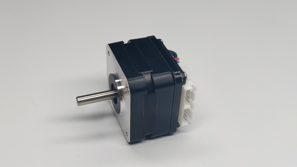
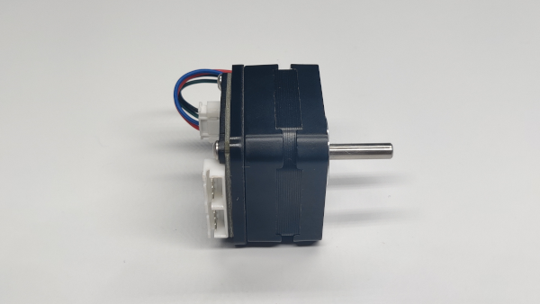
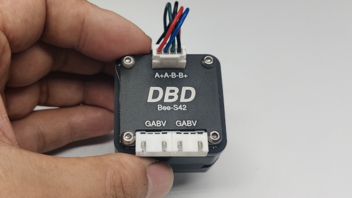
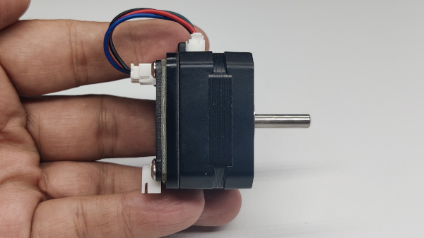
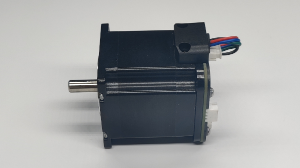
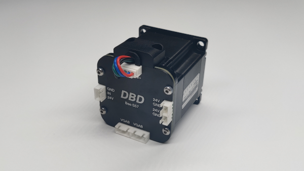
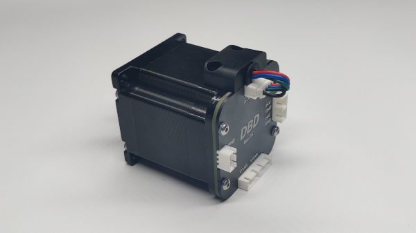
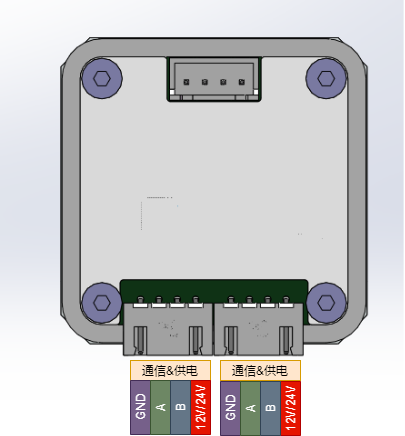

# BeeS 闭环步进电机

⭐ **欢迎使用BeeS系列电机** - DBD团队最新研发的高性能闭环一体步进电机解决方案

## 🚀 产品简介

BeeS是DBD团队开发的总线式一体闭环步进伺服电机，目前主要分为BeeS28、BeeS42、BeeS57三个尺寸型号。采用双电源接口、双RS485隔离通信接口以及正负限位接口。此外还集成了编码器，支持位置模式、速度模式、回零模式(有感/无感)、插补模式等多种运行模式。 

## 📋 目录

- [🚀 产品简介](#-产品简介)
- [📊 产品介绍](#-产品介绍)
  - [性能参数](#性能参数)
  - [产品细节](#产品细节)
  - [机械尺寸](#机械尺寸)
- [🎮 运行模式](#-运行模式)
  - [位置模式](#位置模式)
  - [速度模式](#速度模式)
  - [回零模式](#回零模式)
  - [插补模式](#插补模式)
- [👨‍💻 开发者指南](#-开发者指南)
  - [快速上手](#快速上手)
  - [Python SDK](#python-sdk)
  - [通信协议](#通信协议)
- [📺 相关视频](#-相关视频)
- [🏢 关于DBD](#-关于dbd)
- [📞 技术支持](#-技术支持)


## 📊 产品介绍

### 性能参数

| 参数 | BeeS28 | BeeS42 | BeeS57 |
|------|--------|--------|--------|
| 重量 | 40g | 120g | 200g |
| 细分 | 256 | 256 | 256 |
| 编码器分辨率 | 12bit | 12bit | 12bit |
| 工作电压 | DC12V/24V | DC12V/24V | DC12V/24V |
| 最大持续输出电流 | 0.5A | 1.0A | 1.5A |
| 限位接口 | 正负限位 | 正负限位 | 正负限位 |
| RS485总线速率 | 250Kbps | 250Kbps | 250Kbps |
| 工作温度 | -10°C ~ +60°C | -10°C ~ +60°C | -10°C ~ +60°C |


### 产品细节

#### BeeS42系列

**BeeS4223-V1**

<div align="center">






</div>

**BeeS4223-V2**
> 📸 产品图片即将更新

#### BeeS57系列

<div align="center">





</div>

#### BeeS28系列

> 📸 产品图片即将更新

### 机械尺寸

#### 接口规格
- 电源接口：XH2.54-4P
- 通信接口：RS485差分信号
- 限位接口：数字输入

#### 尺寸图纸

<div align="center">



</div>

> 📐 详细的机械图纸文件：[asm42-23V2.STEP](downloads/asm42-23V2.STEP)

## 🎮 运行模式

### 位置模式
**平滑位置模式** - 点位运动控制

- 📍 **功能描述**：根据设定的目标位置、目标速度以及加速时间，自动规划位置-时间曲线并开始运动
- 🎯 **适用场景**：精确定位、点到点运动
- ⚙️ **控制参数**：目标位置、最大速度、加速时间

### 速度模式
**平滑速度模式** - 连续运动控制

- 📍 **功能描述**：根据设定的目标速度和加速时间，自动规划速度-时间曲线并开始运动
- 🎯 **适用场景**：传送带、风扇等连续运动设备
- ⚙️ **控制参数**：目标速度、加速时间

### 回零模式
**传感器回零模式** - 自动寻找原点

- 📍 **功能描述**：根据设定的回零方向和目标速度开始运动，直到传感器触发后停止运行
- 🎯 **适用场景**：系统初始化、建立坐标系
- ⚙️ **控制参数**：回零方向、回零速度、触发电平

### 插补模式
**同步位置插补模式** - 多轴联动控制

- 📍 **功能描述**：实现最多32轴电机的同步插补运动，执行连续轨迹
- 🎯 **适用场景**：3D打印机、写字机、画图机、雕刻机、点胶机等
- ⚙️ **控制参数**：各轴插补位置、插补速度

## 👨‍💻 开发者指南

### 快速上手

#### 🔧 上位机调试软件
**TunerBeeS for Windows** - 图形化调试工具

<div align="center">

[](downloads/BeeS-Tuner.zip)

[📥 点击下载 TunerBeeS](downloads/BeeS-Tuner.zip)

</div>

#### 📋 通信协议文档

[📄 通信协议详细说明 (Excel)](downloads/BeeS.xls)

### Python SDK

<div align="center">

[](downloads/BeeS-SDK.zip)

[🐍 下载 Python SDK](downloads/BeeS-SDK.zip)

</div>
  

#### SDK接口说明

Python SDK接口分为4类：参数设置(set)、参数获取(get)、等待信号(wait)、功能操作类

##### 🔧 控制接口

| 接口函数 | 功能说明 |
|----------|----------|
| `setPowerOn(id, subid)` | 设置电机使能，电机开始受控制 |
| `setPowerOff(id, subid)` | 设置电机失能，电机停止受控制 |
| `setTargetVelocity(id, subid, value)` | 设置目标速度 (1-300 pulse/ms) |
| `setHomingMode(id)` | 设置为回零模式 |
| `setHomingDirection(id, value)` | 设置回零方向 (1或-1) |
| `setHomingLevel(id, value)` | 设置回零触发电平 (1或0) |

##### 📊 状态查询接口

| 接口函数 | 功能说明 |
|----------|----------|
| `getInputIO(id)` | 获取输入IO状态 (0或1) |
| `getTargetVelocity(id)` | 获取目标速度 |
| `getHomingDirection(id)` | 获取回零方向 |
| `getHomingLevel(id)` | 获取回零电平 |
| `getDeviceID(id)` | 获取设备ID |

##### ⏳ 等待接口

| 接口函数 | 功能说明 |
|----------|----------|
| `waitHomingDone(id)` | 等待回零完成 |
| `waitTargetPositionReached(id)` | 等待目标位置到达 |

##### 🛠️ 系统接口

| 接口函数 | 功能说明 |
|----------|----------|
| `scanDevices()` | 扫描在线设备 |
| `saveParameters(id)` | 保存参数到设备 |
| `changeID(id, value)` | 修改设备ID (0-31) |

#### 环境配置

##### 📦 依赖安装

```bash
# 安装必要的Python库
pip install pyserial pyusb
```

##### 💻 开发环境

- **推荐IDE**：PyCharm、VSCode
- **Python版本**：3.6+

##### 🐧 Linux权限配置

```bash
# 添加串口权限规则
sudo vim /etc/udev/rules.d/70-ttyusb.rules

# 添加以下内容
KERNEL=="ttyUSB[0-9]*",MODE="0666"

# 重新插入USB设备生效
```

##### 🚀 快速开始

1. 下载并解压 [Python SDK](downloads/BeeS-SDK.zip)
2. 将SDK文件复制到项目目录
3. 导入DBDynamics模块开始使用

### 通信协议

#### 🔌 接口规格

- **通信接口**：RS485差分总线
- **默认波特率**：250Kbps
- **数据格式**：8N1 (8数据位，无校验，1停止位)

#### 🏗️ 通信架构

**主从模式**
- 主站：用户控制器/调试器
- 从站：BeeS电机 (ID: 0-31)
- 通信方式：主站发送指令，对应从站响应

#### ⚡ 特殊说明

- **DBD专用USB485**：内置加速MCU，USB侧波特率2Mbps，支持多轴同步插补
- **普通USB转RS485**：直接设置250Kbps，不支持同步插补模式

#### 📋 指令格式

**指令结构** (8字节)
```
[功能码][索引码][主ID][子ID][数据值(4字节)]
```

##### 功能码定义

| 功能码 | 说明 |
|--------|------|
| 0x00 | 读参数指令 |
| 0x01 | 写参数指令 |
| 0x02 | 读取成功响应 |
| 0x03 | 写入成功响应 |
| 0x04 | 操作指令 |
| 0x05 | 操作成功响应 |

##### 主要索引码

| 索引码 | 参数名称 | 读写 | 说明 |
|--------|----------|------|------|
| 0x00 | 主板类型 | R | 设备类型标识 |
| 0x01 | 设备ID | R/W | 设备地址 (0-31) |
| 0x02 | 使能状态 | R/W | 1=使能, 0=失能 |
| 0x03 | 运行模式 | R/W | 21=速度, 31=位置, 34=插补, 40=回零 |
| 0x04 | 状态信息 | R | 设备状态字 |
| 0x07 | 目标速度 | R/W | 电机目标转速 |
| 0x08 | 实际速度 | R | 电机当前转速 |
| 0x09 | 目标位置 | R/W | 电机目标位置 |
| 0x0A | 实际位置 | R/W | 电机当前位置 |
| 0x0B | 加速时间 | R/W | 加减速时间 (ms, ≥200) |
| 0x0E | 回零方向 | R/W | 1=正向, -1=负向 |
| 0x0F | 回零电平 | R/W | 1=高电平, 0=低电平 |
| 0x16 | 输入IO状态 | R | 传感器状态 |

##### 参数说明

- **主ID**：设备地址 (0-31)
- **子ID**：扩展地址 (0-7，通常为0)
- **数据格式**：32位整数，低位在前
  - 示例：100 → `0x64 0x00 0x00 0x00`
  
#### 📊 状态字定义

##### 控制字 (ControlWord)

| 位 | 掩码 | 说明 |
|----|------|------|
| BIT0 | 0x01 | 电机使能 (1=使能, 0=失能) |

##### 状态字 (StatusWord)

| 位 | 掩码 | 说明 |
|----|------|------|
| BIT0 | 0x01 | 使能状态 (1=已使能, 0=未使能) |
| BIT1 | 0x02 | 回零状态 (1=已回零, 0=未回零) |
| BIT2 | 0x04 | 位置到达 (1=已到达, 0=未到达) |
| BIT3 | 0x08 | 传感器状态 (1=触发, 0=未触发) |
| BIT6 | 0x40 | 急停状态 (1=急停, 0=正常) |
| BIT7-9 | 0x380 | 运行模式状态值 |

##### 运行模式状态值

| 值 | 模式 |
|----|------|
| 0 | 平滑位置模式 |
| 1 | 平滑速度模式 |
| 2 | 传感器回零模式 |
| 3 | 无传感器回零模式 |
| 4 | 快速急停模式 |
| 5 | 平滑急停模式 |
| 6 | 同步插补模式 |
  

#### 💡 位操作示例

##### 设置控制字
```python
# 设置使能位
value |= (0x1 << 0)  # BIT0 = 1, 使能电机

# 清除使能位
value &= ~(0x1 << 0)  # BIT0 = 0, 失能电机
```

##### 读取状态字
```python
# 检查回零状态
if (status_value & (0x1 << 1)) != 0:
    print("电机已回零")
else:
    print("电机未回零")

# 检查位置到达
if (status_value & (0x1 << 2)) != 0:
    print("目标位置已到达")
```

#### 📝 指令示例

##### 常用指令 (16进制)

**1. 读取设备类型 (ID=1)**
```
发送: 0x00 0x00 0x01 0x00 0x00 0x00 0x00 0x00
返回: 0x02 0x00 0x01 0x00 0x11 0x00 0x00 0x00
```

**2. 使能电机 (ID=1)**
```
发送: 0x01 0x02 0x01 0x00 0x01 0x00 0x00 0x00
```

**3. 失能电机 (ID=1)**
```
发送: 0x01 0x02 0x01 0x00 0x00 0x00 0x00 0x00
```

## 📺 相关视频

<div align="center">

| 教程内容 | 链接 |
|----------|------|
| 🎬 写一段代码让电机运行起来 | [观看视频](https://www.bilibili.com/video/BV12eH5eaEeC) |
| 🔗 如何连接两台电机 | [观看视频](https://www.bilibili.com/video/BV1q1HgeBEcH) |
| ⚙️ 修改代码让两个电机跑起来 | [观看视频](https://www.bilibili.com/video/BV12YH5eAE2V) |

</div>

## 🏢 关于DBD

DBD是一家专注于创新矩阵运动技术的初创制造商。作为电机驱动器、控制器和系统的制造商和开发商，DBD在设计技术时注重性能、效率、可靠性、安全性和简洁性。

*DBD is a startup manufacturer of innovative matrix motion technologies, and as a manufacturer and developer of motor drives, controllers, and systems, DBD is designing its technology with emphasis on performance, efficiency, reliability, safety and simplicity.*

## 📞 技术支持

如果您有任何问题，请随时联系我们：

<div align="center">


**扫码添加微信获取技术支持**

</div>

---

<div align="center">

**© 2024 DBD Team. All rights reserved.**

⭐ 如果这个项目对您有帮助，请给我们一个Star！

</div>